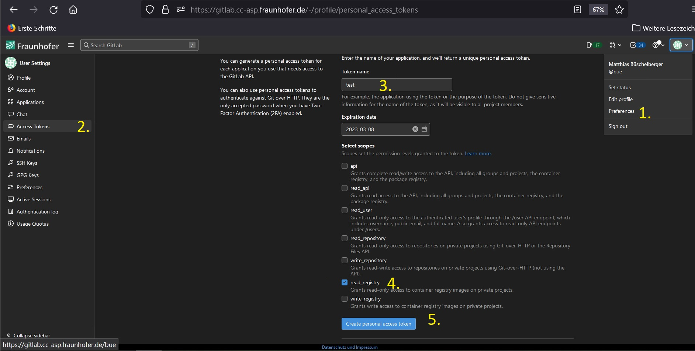
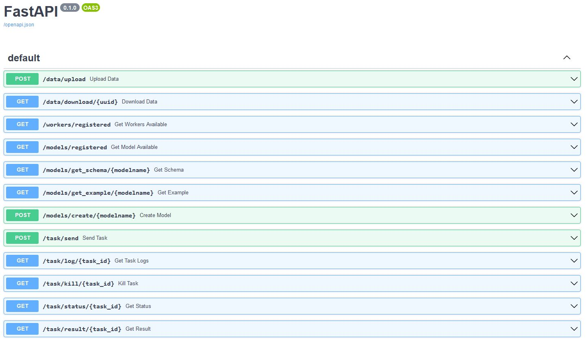

# Installation and setup guide

## Run with Docker

### Docker engine

For using the application provided by this repository, please make sure to install a **Docker**-engine version > `v20.0.0` .

A detailed installation guide for **Windows**, **Linux** and **macOS** for this software can be found on [the main docker-docs](https://docs.docker.com/engine/install/).

### Docker compose

On top the Docker-engine, a small tool called *docker-compose* is needed in order to orchestrate multiple containers at once. The source-code is written in Python and freely available in the [Official GitHub Group](https://github.com/docker/compose).

> **Note for Windows- and macOS-users**: _If you installed the Docker-engine on macOS or Windows, docker-compose is already included in the distributed version_

> **Note for linux-users**: _You may either install the docker-compose binary from the `apt`-servers via `apt-get install docker-compose` (for Ubuntu 18.04 and later), install it through Python with `pip install docker-compose` if you already have a Python-distribution installed or download the binaries from the [release-page](https://github.com/docker/compose/releases). Detailed instructions can be found on the [Digital Ocean How-to-page](https://www.digitalocean.com/community/tutorial_collections/how-to-install-docker-compose) or the [README from the offical GitHub](https://github.com/docker/compose/tree/v2.15.1#linux).


### Login to Fraunhofer Docker registry

For pulling the Docker-images, you will need to login via commandline on the machine you installed your Docker distribution on. For this procedure you can login either:

* with your general Gitlab-password (_**not** recommended_)
* a generated access-token (_recommended_)

> Note: _If you would like to proceed with an access-token please log into the [Fraunhofer Gitlab](https://gitlab.cc-asp.fraunhofer.de/), navigate to your avatar in the upper right corner and click on `Preferences`. Now, please open the submenu `Access tokens` in the toolbar on the lefthand side. Create a new access token with a new **name** and select the `read_registry`-checkbox. Please store this token in a password-database or elsewhere. You will **not** be able to read it again, when you refresh or close the page. However, you can also add new or delete old access tokens. For this application, you will only need it once for downloading the images. You might need to refresh or add a new token, when you want to update your docker images after the token as expired._


Type in:

```docker login registry.gitlab.cc-asp.fraunhofer.de/reaxpro```

Use your username, *as it is displayed _after_ the @ under your Gitlab avatar in right left corner* and your password or access-token.

If successfull, you should see the following traceback:

`Login Succeeded`

> Note: The message:
 `WARNING! Your password will be stored unencrypted in /home/<user>/.docker/config.json` is normal when you do not use a credential helper. This is also why an access-token is recommended for logging into the registry, since it can be easiliy removed and expires automatically after a given amount of time.

### Setup the files

Make a new file called `.env` and add it to a directory of your choice. This is going to be your **runtime**-directory.

> Note: _If you cloned the source code of this repository, you may simply copy the `.env.template` into a new file called `.env`._

If you did not clone the repository from source and wrote a new empty file as written above, make sure that your `.env`-file has the following content:

```
BUILD_VERSION=v2.0.0

AUTHENTICAION_DEPENDENCIES=False

PYTHON_BIN=python3
REAXPRO_FASTAPI_HOST=0.0.0.0
REAXPRO_FASTAPI_PORT=8081
REAXPRO_WORKER_CONCURRENCY=5

REAXPRO_SCHEMAS="osp.models.multiscale.co_pt111_full:COPt111FullscaleModel| osp.models.multiscale.co_pt111_full:COPt111FromMesoScaleModel | osp.models.multiscale.co_pt111_meso:PESExploration | osp.models.multiscale.co_pt111_meso:COPt111MesoscaleModel  | osp.models.catalytic.co_catalyticfoam:COCatalyticFOAMModel | osp.models.ams.energy_landscape_refinement:EnergyLandscapeRefinement |  osp.models.zacros.co_pyzacros:COpyZacrosModel"
REAXPRO_WORKER_MAPPING="emmo.ContinuumCalculation:simphony-catalyticfoam|emmo.AtomisticCalculation:simphony-ams|emmo.MesoscopicCalculation:simphony-zacros"

AMSHOME=/data/volume_1/Software/ams2022
ADFHOME=/data/volume_1/Software/ams2022
ADFBIN=/data/volume_1/Software/ams2022/bin
AMSBIN=/data/volume_1/Software/ams2022/bin
AMSRESOURCES=/data/volume_1/Software/ams2022/atomicdata
ADFRESOURCES=/data/volume_1/Software/ams2022/atomicdata
SCMLICENSE=/data/volume_1/Software/ams2022/license.txt

REAXPRO_MINIO_USER=rootname
REAXPRO_MINIO_PASSWORD=rootname123

```

> Note: _The `BUILD_VERSION` may be bumped to another version from time to time. If a new version shall be used, please update the version number and re-run the following steps of this guide in order to bring up the newest containers._

Now, we check the content of our docker-compose-file. If you did not clone from source, make a new file called `docker-compose.yml` and make sure that it has the following content:

```
version: "3"

services:
  fastapi:
    image: "registry.gitlab.cc-asp.fraunhofer.de/reaxpro/fastapi-celery:${BUILD_VERSION:-latest}"
    ports:
      - "${REAXPRO_FASTAPI_PORT:-8080}:8080"
    environment:
      REAXPRO_REDIS_TYPE: redis
      REAXPRO_REDIS_HOST: redis
      REAXPRO_REDIS_PORT: 6379
      REAXPRO_REDIS_DB: 3
      REAXPRO_SCHEMAS: ${REAXPRO_SCHEMAS}
      REAXPRO_MINIO_ENDPOINT: minio:9000
      REAXPRO_MINIO_USER: ${REAXPRO_MINIO_USER}
      REAXPRO_MINIO_PASSWORD: ${REAXPRO_MINIO_PASSWORD}
      REAXPRO_FASTAPI_HOST: ${REAXPRO_FASTAPI_HOST:-'0.0.0.0'}
      REAXPRO_FASTAPI_PORT: ${REAXPRO_FASTAPI_PORT:-8080}
      REAXPRO_AUTHENTICATION_DEPENDENCIES: ${AUTHENTICATION_DEPENDENCIES}
      PYTHON_BIN: ${PYTHON_BIN:-python3}
      APP_MODE: server
    depends_on:
      - redis
      - minio
    networks:
      - reaxpro

  headworker:
    image: "registry.gitlab.cc-asp.fraunhofer.de/reaxpro/fastapi-celery:${BUILD_VERSION:-latest}"
    environment:
      REAXPRO_WORKER_NAME: simphony-workflows
      REAXPRO_REDIS_TYPE: redis
      REAXPRO_REDIS_HOST: redis
      REAXPRO_REDIS_PORT: 6379
      REAXPRO_REDIS_DB: 3
      REAXPRO_WORKER_MAPPING: ${REAXPRO_WORKER_MAPPING}
      REAXPRO_MINIO_ENDPOINT: minio:9000
      REAXPRO_MINIO_USER: ${REAXPRO_MINIO_USER}
      REAXPRO_MINIO_PASSWORD: ${REAXPRO_MINIO_PASSWORD}
      REAXPRO_WORKER_CONCURRENCY: ${REAXPRO_WORKER_CONCURRENCY:-5}
      PYTHON_BIN: ${PYTHON_BIN:-python3}
      APP_MODE: worker
    depends_on:
      - redis
      - minio
    networks:
      - reaxpro

  catalyticfoam:
    image: "registry.gitlab.cc-asp.fraunhofer.de/reaxpro/fastapi-celery:catalyticfoam-${BUILD_VERSION:-latest}"
    environment:
      REAXPRO_WORKER_NAME: simphony-catalyticfoam
      REAXPRO_WRAPPER_NAME: osp.wrappers.simcatalyticfoam.simcatalyticfoam:SimCatalyticFoamSession
      REAXPRO_REDIS_TYPE: redis
      REAXPRO_REDIS_HOST: redis
      REAXPRO_REDIS_PORT: 6379
      REAXPRO_REDIS_DB: 3
      REAXPRO_MINIO_ENDPOINT: minio:9000
      REAXPRO_MINIO_USER: ${REAXPRO_MINIO_USER}
      REAXPRO_MINIO_PASSWORD: ${REAXPRO_MINIO_PASSWORD}
      REAXPRO_WORKER_CONCURRENCY: ${REAXPRO_WORKER_CONCURRENCY:-5}
      PYTHON_BIN: ${PYTHON_BIN:-python3}
      APP_MODE: worker
    depends_on:
      - redis
      - minio
    networks:
      - reaxpro

  ams:
    image: "registry.gitlab.cc-asp.fraunhofer.de/reaxpro/fastapi-celery:${BUILD_VERSION:-latest}"
    environment:
      REAXPRO_WORKER_NAME: simphony-ams
      REAXPRO_WRAPPER_NAME: osp.wrappers.simams.simams_session:SimamsSession
      REAXPRO_REDIS_TYPE: redis
      REAXPRO_REDIS_HOST: redis
      REAXPRO_REDIS_PORT: 6379
      REAXPRO_REDIS_DB: 3
      REAXPRO_MINIO_ENDPOINT: minio:9000
      REAXPRO_MINIO_USER: ${REAXPRO_MINIO_USER}
      REAXPRO_MINIO_PASSWORD: ${REAXPRO_MINIO_PASSWORD}
      REAXPRO_WORKER_CONCURRENCY: ${REAXPRO_WORKER_CONCURRENCY:-5}
      PYTHON_BIN: ${PYTHON_BIN:-python3}
      AMSHOME: ${AMSHOME}
      ADFHOME: ${ADFHOME}
      ADFBIN: ${ADFBIN}
      AMSBIN: ${AMSBIN}
      AMSRESOURCES: ${AMSRESOURCES}
      ADFRESOURCES: ${ADFRESOURCES}
      SCMLICENSE: ${SCMLICENSE}
      APP_MODE: worker
    volumes:
      - ${AMSHOME}:${AMSHOME}:rw
      - ${AMSRESOURCES}:${AMSRESOURCES}:rw
      - ${SCMLICENSE}:${SCMLICENSE}:rw
    depends_on:
      - redis
      - minio
    networks:
      - reaxpro

  zacros:
    image: "registry.gitlab.cc-asp.fraunhofer.de/reaxpro/fastapi-celery:${BUILD_VERSION:-latest}"
    environment:
      REAXPRO_WORKER_NAME: simphony-zacros
      REAXPRO_WRAPPER_NAME: osp.wrappers.simzacros.simzacros_session:SimzacrosSession
      REAXPRO_REDIS_TYPE: redis
      REAXPRO_REDIS_HOST: redis
      REAXPRO_REDIS_PORT: 6379
      REAXPRO_REDIS_DB: 3
      REAXPRO_MINIO_ENDPOINT: minio:9000
      REAXPRO_MINIO_USER: ${REAXPRO_MINIO_USER}
      REAXPRO_MINIO_PASSWORD: ${REAXPRO_MINIO_PASSWORD}
      REAXPRO_WORKER_CONCURRENCY: ${REAXPRO_WORKER_CONCURRENCY:-5}
      PYTHON_BIN: ${PYTHON_BIN:-python3}
      APP_MODE: worker
    depends_on:
      - redis
      - minio
    networks:
      - reaxpro


  redis:
    image: redis:latest
    volumes:
      - redis-data:/data
    networks:
      - reaxpro

  minio:
    image: quay.io/minio/minio
    ports:
      - 9000
    environment:
      MINIO_ROOT_USER: ${REAXPRO_MINIO_USER}
      MINIO_ROOT_PASSWORD: ${REAXPRO_MINIO_PASSWORD}
    volumes:
      - minio-data:/data
    command: server /data
    networks:
      - reaxpro

volumes:
  redis-data:
  minio-data:

networks:
  reaxpro:

```

### Pull the latest images

In order to download the latest images, navigate with your commandline into the **runtime**-directory with your `.env` and `docker-compose.yml`.

Simply type:

`docker-compose pull`

Expected output:

```
WARNING: The AUTHENTICATION_DEPENDENCIES variable is not set. Defaulting to a blank string.
Pulling redis         ... done
Pulling fastapi       ... done
Pulling ams           ... done
Pulling catalyticfoam ... done
Pulling headworker    ... done
```

> **Troubleshooting**:
>
> `Can't find a suitable configuration file in this directory or any parent. Are you in the right directory?`
>
> You are not in the **runtime**-directory with the `.env`- or `docker-compose.yml`-file
>

> **Troubleshooting**:
>
> `ERROR: for simphony  pull access denied for simphony-reaxpro, repository does not exist or may require 'docker login': denied: requested access to the resource is denied`
>  
> You did not place the `.env`-file in the same directory as your `docker-compose.yml` or docker could not source the `.env`-file (due to a potential syntax-error).
>

### Bring up the containers

Simply type:

`docker-compose up -d`

Expected output:

```
WARNING: The AUTHENTICATION_DEPENDENCIES variable is not set. Defaulting to a blank string.
Creating network "fastapi-celery_reaxpro" with the default driver
Creating volume "fastapi-celery_redis-data" with default driver
Creating volume "fastapi-celery_diskcache" with default driver
Creating fastapi-celery_redis_1 ... done
Creating fastapi-celery_fastapi_1 ... done
Creating fastapi-celery_catalyticfoam_1 ... done
Creating fastapi-celery_headworker_1    ... done
Creating fastapi-celery_ams_1           ... done
```

Check if the containers are running by displaying their process status through typing:

```
docker-compose ps
```

> **Note**: _Make sure you type this command in your **runtime**-directory!_

Expected output:
```
             Name                           Command               State                    Ports  
------------------------------------------------------------------------------------------------------------------
fastapi-celery_ams_1             /bin/bash -c -l celery -A  ...   Up  
fastapi-celery_catalyticfoam_1   /bin/bash -c -l celery -A  ...   Up  
fastapi-celery_fastapi_1         ./docker_entrypoint.sh           Up      0.0.0.0:8080->8080/tcp,:::8080->8080/tcp
fastapi-celery_headworker_1      ./docker_entrypoint.sh           Up      8080/tcp  
fastapi-celery_redis_1           docker-entrypoint.sh redis ...   Up      6379/tcp  
```

You may now launch `localhost:8080/docs` in your browser:



### Stop the containers

Simply type:

`docker-compose stop`

### Remove the containers

Simply type:

`docker-compose down`

## Run with singularity/apptainer

Instead of using `Docker`, you may also use [`Singularity`](https://docs.sylabs.io/guides/latest/user-guide/).

The platform has been tested with a singularity/apptainer version `1.1.9`. Make sure that you are using a similar or higher version.

```{Note}
This setup for singularity/apptainer tool is roughly expecting the default system configuration which has been deployed during installation.
```

For running the containers, please refer to the `singularity`-subdirectory of the [source code repository](https://github.com/simphony/reaxpro-workflow-service/tree/main/singularity) and copy all the included files there (bash files and environmental files).

Start the platform by adjusting the `.env.example ` by your needs. You will use this env-file for running and managing the platform constantly.

Login into the registry by typing:

```
singularity remote login --username <your-usename> registry.gitlab.cc-asp.fraunhofer.de/reaxpro/fastapi-celery
```

Pull the images with the following scripts:

```
bash pull-minio.sh && bash pull-redis.sh && bash pull-reaxpro.sh .env.example
```

Start the platform by running:
```
bash run-forst-launch.sh .env.example
```

You can access the FastAPI now by routing to the host and port configuration you assigned in the `.env.example`.

Stop the container processes by running:
```
bash kill_processes && bash kill_databases
```

You may also access the containers (e.g. for direct solver-execution) directly by running:

```
bash enter-reaxpro.sh .env.example
```
