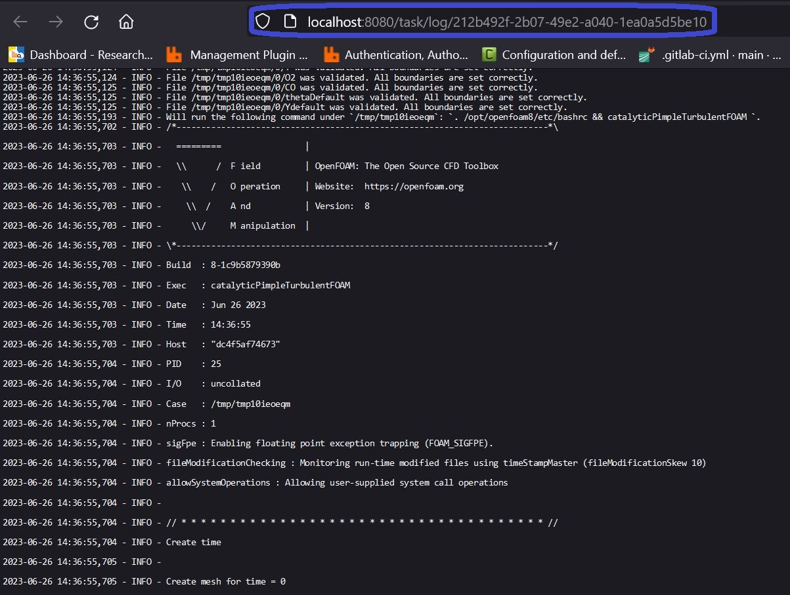

# Quick start: launch a simulation through the FastAPI

```{note}
This is the technical description how to lauch a simulation and retrieve the results by using the platform API. Hence, this is _**not**_ a description of the scienfitic models of the simulation engines for each use case. If you are particularly interested in this, please do to the **use case chapter** of this document.
```

When launching `localhost:8080/docs` in your browser, you have the opportunity to inspect and test out the different endpoints of the [REST API](https://en.wikipedia.org/wiki/Representational_state_transfer) as well as their in- and outputs.

The service is listening under port 8080, which is forwarded from the `fastapi-celery_celery_1`-container.
The top-level API of the platform on which you operate is deployed there.

Simulation engines and their [Python-wrappers](https://gitlab.cc-asp.fraunhofer.de/simphony/wrappers/reaxpro-wrappers) within additional containers (e.g. `fastapi-celery_catalyticfoam_1` for catalyticFOAM)are connected through a message broker called `redis` (in the `fastapi-celery_redis_1`-container). This means we can add as many containers with individual simulation engines to the platform as we need without re-installing the top-level REST API, as long as they are connected to the `redis`-container.

## Inspect workers

First of all: check the simulation-workers available in the docker-compose network.

For this purpose we can navigate to the `/worker/registered`-endpoint, unfold the tab and click on the `Try it out`-button.


After doing this, we are able to execute the function behind this endpoint. For this action, we do not need any futher parameters.


The result of the http-body is a text in the JSON-format with a mapping between the individual workers and their tasks they can offer. The one for catalyticFOAM is here called `simphony-catalyticfoam`:


```{note}
You can also run these function without the need of the swagger-ui. The equivalent in `bash` would be:

`curl -X 'GET' 'http://localhost:8080/workers/registered' -H 'accept: application/json'`


As you can see from the screenshot, this snippet of code can be directly copied from the swagger-ui endpoint documention.
```

```{note}
You can also run these endpoints through a client-server-interaction in Python **without the need to install any package** besides the standard ones which are by default in any Python-distribution. If you are interested in this, please have a look in the next chapter of this document.
```

```{note}
Of course, the current implementation of the platform does the mapping between the data models (in the next subchapter) and the workers internally. Hence, the response of this endpoint is more of a side-information useful for development and configuration.

For the further scope of this tutorial, the info from this endpoint is not needed anymore. But it is also a good start for understanding the fundamental architecture :smile:.

Potentially, the platform user may choose about the workers which are supposed to execute different simulations for each instanciated data model in the future. This may give the opportunity to switch between simulation engine versions on different clusters etc.
```

## Interacting with data models

Now, we would like to create a cached containing the needed metadata for running a catalyticFoam-simulation with the default use cases.

### **Get registered data models**

For this procedure, we will need to inspect what kind of data models are available within our platform.

Please natigate to the `models/registered`-section:


After hitting "`Try it out`" and "`Execute`"-button again, we get another JSON with an array exposing the data models available.

However, this information is not really complete in order to directly work with it.

Since we understand a data model as a collection of entities representing material properties and simulation parameters for a specfic use case, we will need to insecpt what kind of data entities and types are needed in order to build an instance of a model.

### **Get the schema of a data model**

For receiving this kind of information, we call the `/models/get_schema/{modelname}`-endpoint:


As may notice, the path of this endpoint is expecting a parameter `{modelname}` which is mandatory variable to set when it is called. This parameter receives values from the `models/registered`-section. In the case of our simple catalyticFoam-use-case, it is the `COCatalyticFOAMModel` which we need to insert.

The **schema** of a data model is related to the representation of the [OpenAPI standard](https://swagger.io/docs/specification/data-models/). Hence, this endpoint returns as another JSON-payload with the specification of the collection-items.

The marked window of the `Response body` is holding this JSON. However, since it is hard to inspect in this printed version, we are going to open the `http://localhost:8080/models/get_schema/COCatalyticFOAMModel`-url in a new tab.

In the Firefox-browser, we are able to use an in-built JSON-reader which can help us displaying the payload in a more well-arranged manner:


After hitting "`Collapse All`" (here "`Alle einklappen`" since the browser language is set to German), you can see the top-level entities which are represented in our **schema**.

### **Understanding the schema of a data model**

Since the `COCatalyticFOAMModel` is the actual model we would like to investigate, we will further expand the items under this keyword. The other entities like `Velocity`, `Temperature`, etc. are other definitions of items, which are used internally by the `COCatalyticFOAMModel` later on, but are described at the top-level of the JSON in order to prevent an unnecessarily *overnested* structure of the schema.


After unfolding the first items of the `COCatalyticFOAMModel`, you will see some keywords like `title` and `description` which are giving us the most basic human-readable information about the entity we are analysing in the schema.

When we build an instance of our `COCatalyticFOAMModel` later on, we have to understand that this model itself is serialized into a JSON again. Since JSON is a key-value representation of data, the types for the value of an JSON-entry can vary between strings, integers, booleans, floats, arrays, etc. The `properties`-section in our **schema** here is teaching us what kind of key-value-pairs need to be set in our JSON for the `COCatalyticFOAMModel`-instance.

Under this `properties`-section, we observe all the keywords which we are allowed to set in the JSON for our `COCatalyticFOAMModel`, e.g. `chemical_species`, `species_from_upload`, `velocity`, `pressure`, etc.

If we have a closer look e.g. on the `chemical_species`-item, we see that the `type` has to be an `array`, whose subitems have to be a `ChemicalSpecies`. By setting the related to `$ref`, the schema redirects us the to the JSON-path were this `ChemicalSpecies` is defined, which is at the top-level of the JSON-schema we are currently looking at (see description above). By expanding the `ChemicalSpecies`-tab, you may observe that also this entity is also expecting `properties` like `boundaries`, `composition` and `mass_fraction`, which are partly pointing towards other references like `#/definitions/BoundaryCondition`.

After getting this first few information, we can already assert that the needed JSON for building our `COCatalyticFOAMModel` instance would some look like this (strongly oversimplified):

```
{
  "chemical_species": [
      {
        boundaries=...,
        composition=...,
        mass_fraction=...
      },
      {
        boundaries=...,
        composition=...,
        mass_fraction=...
      },
      {
        boundaries=...,
        composition=...,
        mass_fraction=...
      }
    ]
}
```

```{note}
Since we do not want to focus how to build an example from scratch within this tutorial, we will only have a look on a specific parameter for our model. We definitely could spend more time on investigating the single items and their `$ref` in the JSON-schema. But in order to focus more on the direct API-usage of the platform, we would like to postpone this detailed reference of the schema to the related use case to a dedicated chapter of this documentaion.

Therefore, we would like to give just a rough guideline how to navigate and understand this OpenAPI-schema for data models.

In order to overcome the piece-by-piece setup of the example from scratch, we can simply download a JSON with a running case and modify it by our needs. This will be covered in the next subsection of this document.
```

After all, we are currently interested to set the maximum simulated time of our `COCatalyticFOAMModel`.

For this purpose, we further inspect the items under `properies` from the `COCatalyticFOAMModel`-object in our schema. Almost at the bottom of this subsection, you will find a key called `maxtime`:


As you can see, the `type` of the value for the `maxtime`-key is a `number` and the `default` of this value is `1e-7`. This basically means that this is an optional parameter which we do not _have_ to specify while building our model instance. Nevertheless, the wall time of the simulation will definitely a couple of days, if we do not downscale the simulation significantly for this minimal example. E.g. we can also observe that the `default` value of the `delta_t`-property is `1-e8`. Hence, we can simply let our model run just for one timestep by setting the `maxtime`-property to `1-e8`. We will do this in the next two subsection of this tutorial.


### **Retrieve an example of a data model**

As aleady announced in the previous subsection, we are able to receive a running example from the platform in order to avoid the cumbersome generation of a `COCatalyticFOAMModel` from scratch.

For doing so, please go to the `models/get_example/{modelname}`-endpoint and insert the name of the model we would like to analyze, which is `COCatalyticFOAMModel` here again:


After hitting the copy-icon at the bottom of the response-window, we simply can copy the output of this endpoint to our clipboard and use it in the next step for the model instanciation.

### **Create a data model**

For this procedure, we navigate to the `models/create/{modelname}`-endpoint:


Once again, we will need to add the `COCatalyticFOAMModel` as `modelname` as required parameter into our endpoint.

We are now using a `POST`-strategy, which means that the body of our http-request now contains an approved [IANA-mediatype](https://www.iana.org/assignments/media-types/media-types.xhtml). In this example, we are using the JSON-mediatype as it was used in the response bodies of the previous endpoints.

The body of the payload can be customized in an editor within the Swagger-UI before submission.

As announced in the previous subsection, we would like to downscale the maximum simulated time to `1e-8` in order to make a quick run of the model.

For this purpose we are adding the following key-value pair to our JSON-payload:

```
{
  ...,
  "maxtime": 1e-8,
  ...,
}
```

```{note}
The order of the `properties` in the `COCatalyticFOAMModel` (see schema explainations above) does not really matter. However, we have to be sure that the item is placed into the correct _level_ of the JSON so that it is properly assigned `COCatalyticFOAMModel`-object and not to any depending submodel, such as e.g. `solver_options`, `velocity`, `chemical_species` etc. For this action, it is recommended to recapitulate the definition of the [JSON-format](https://www.w3schools.com/whatis/whatis_json.asp) and how we can nest different items into it. In order to make the example work without further reading, you may also study the placement of the item into the playload from the screenshot above.
```

After submitting the request at `models/create/{modelname}` with the `Execute`-button again, we receive another JSON as response with a `cache_id`. This key is giving us the serialized data model in the form of a [knowledge graph](https://en.wikipedia.org/wiki/Knowledge_graph) back from the cache later on.


```{note}
The cache is the in- and output reference for any simulation on the platform has a default life time of 2 weeks (can be extended by the platform administrator by setting the docker-compose variables). The platform itself is **not** a permanent storage and is not meant to be as such due to various technical reasons. The cache also gives the opportunity, that the user may load other custom data models and even whole use case directories into or out of the cache. The `models/create/{modelname}`-endpoint is only a helper-function to create the complex data models within the boundaries of the platform. The data can also be directly loaded into the cache without this function, e.g. if they have been retrieved from an external storage (e.g. NOMAD, MarketPlace, MaterialsCloud, Optimade, etc.). The REST API is hence the technical realization which is providing the seamless interoperability between external services and shall help a user to orchestrate the complexity of multiscale simulations as well as the dataflow between various platforms. The introduction of a diskcache was chosen since it represents the most reasonable solution to enable a user to upload any custom data(-set) to give the broadest flexibility without overloading the memory- or diskspace over time. Criticism and feature requests are always welcome and can be submitted by contacting the platform developers or by submitting an issue in the code repository.
```

## Run a simulation with a created data model

During this step, we would like to submit our created data model to a job. For this action, we use the `cache_id` from the `models/create/{modelname}`-endpoint.

Please inspect how we pasted the marked JSON into the request-body of the `tasks/send`-endpoint (which obviously is a `POST`-strategy again):


The `format`-parameter is optional value to set in the JSON of the predefined payload of this endpoint. It is referencing to the serialization type of the knowledge graph of the data model in the cache of the platform. The `models/create/{modelname}` is using a `turtle`-format while creating the model, so that we do not need to change anything here. However, if the knowledge graph of the data model is provided by an external storage, e.g. from the [MarketPlace](https://materials-marketplace.eu/), we can also manually upload it into the cache under the `data/upload`-endpoint. In this case, the `format` of the graph might also be `owl`, `n3` or `ld-json` and we would need to change the value here.

After executing the `Execute`-button, we receive a JSON with a `task_id` along other `metadata` of the submitted task:


This `task_id` is a separated identifier next to the `cache_id` of the data model, since the latter one is related to a validated knowledge graph in our cache and the first one is an associated simulation job running with this validated data model. Ergo, we can run multiple jobs without re-uploading the same data again. This especially becomes handy, when we are working with DFT and molecular dynamics, since we are simply referencing to the same structures and molecules over and over again.

## Get the status and logging messages of a submitted job

By insert the `task_id` in the `tasks/status/{task_id}`-route, we can retrieve the status of a task:


Nevertheless, this information might not be suifficient in case the job might fail or in case we would like to see the current timestep of our simulation.

For this purpose, we can insert our `task_id` also in the `task/log/{task_id}`-endpoint:


We see oncemore, that this content of mediatype `text/plain` is barely reable in this small response-window.

By opening the "`Request URL`" in another tab in the browser, we have the opporunity to read them more properly:



## Get the results of a succeeded job

When the `status`-item under the `task/status/{task_id}`-route is showing us `SUCCESS`, we are able to download the results from the platform.

For this purpose, we have to consider that the internal storage of the platform is consisting out of a cache, which is separating the knowledge graph of the metadata about the simulation plus the material and the actual raw data as output from the simulation in separated manner. If we e.g. would like to investigate the maximum temperature or maximum mass fraction of a patch for a certain chemical species, we can query this knowledge graph without the need to download the potentially large raw data, which we would need to unpack, open, compare, etc.

In order to retrieve the information where both, the raw and metadata, are located in our cache, we are asking the `task/results/{task_id}` with our `task_id` what the cache-identifiers for those are:


As almost expected, we can extract the identifiers of the knowledge graph for the overall simulation workflow and the raw data produced by each single simulation engine separately. Since we only ran a task with one CatalyticFoam-job through the `simphony-catalyticfoam`-worker (see subsection how to retrieve registered workers above), there is only one compressed archive with raw data associated in the response.

Since the knowledge graph is one of the fundamental technologies used within the platform for interoperability, we will dedicate an extra tutorial related how to query knowledge graphs with respect to [competency questions](https://tishchungoora.medium.com/ontology-competency-questions-3d213eb08d33).

For the scope of this tutorial, we simply would like to download the tarball-file with the raw data and see how we can prepare them for the further inspectation e.g. in `ParaView` for drawing profiles and such.

In order to download this compressed archive, we copy the identifier related to `0_simphony-catalyticfoam` from the `cache_raw` item.

This id needs to be inserted as parameter into the `data/download/{uuid}`-route:


After hitting the "`Execute`"-button, you are able to download the file through your browser as a streamed body response.
Simply click the highlighted "`Download file`"-text in the response section.

Once the download is completed, you are able to use any compatible tool or software for extracting the files from the archive.

Here is one example code by using the `tar`-commandline-tool in `bash`:

```bash
# first of all, make a new directory where the files shall be extracted to
mkdir results

# move the downloaded tarball to this new folder
mv <download-tarball-file> results/

# enter the results folder
cd results/

# extract the raw data
tar -xvf <download-tarball-file>
```
