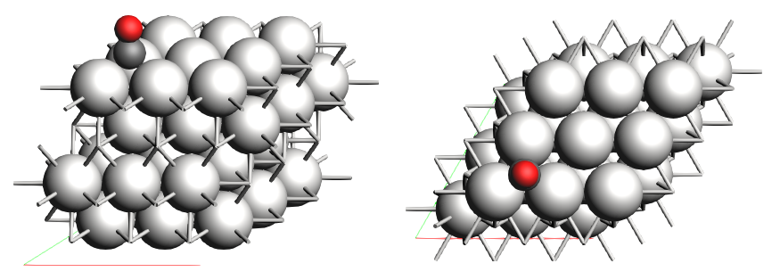
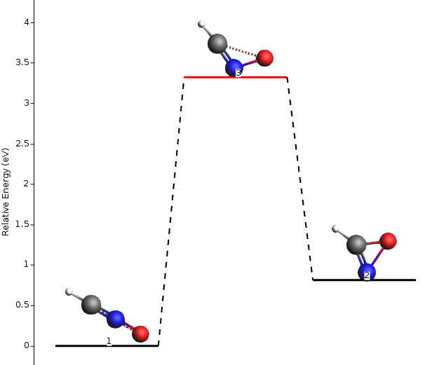
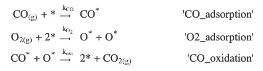
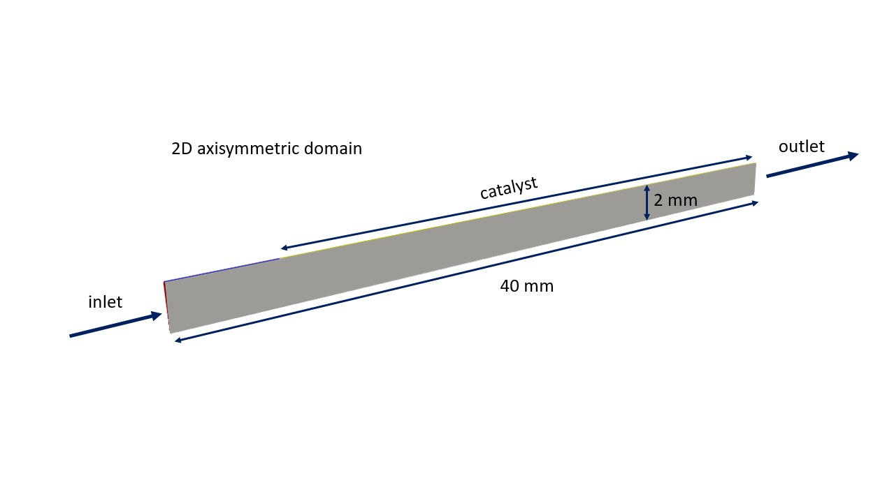

# Use cases

This chapter is supposed to presented the single use cases covered within the ReaxPro user platform.

## RES Calculation

### Overview

In the first use case, we will perform a Potential Energy Surface (PES) Exploration for calculation the critical points of local minima and saddle points. They are a critical quantities that reveal the energetic relationships between different configurations of atoms and molecules and hence singificant for potential
chemical reactions.

The PES Exploration involves the systematic exploration of the potential energy surface of a molecular or material system. This surface represents the energy landscape as a function of atomic positions, revealing important features like stable conformations, transition states, and reaction pathways.

### OpenAPI schema

```{note}
The input schema can be retrieved from the `/models/get_schema/PESExploration`-endpoint.
```

The PESExploration model entity encompasses a range of parameters that guide the exploration process on the potential energy surface.

* **force_field**: This parameter specifies the force field utilized for the AMS calculation. It dictates how the atomic interactions are computed during the exploration. The options for this parameter include OPLSAA, OPLS, AMBER, CHONSFPtClNi, and ANAKINME. The default force field is CHONSFPtClNi.

* **solver_type**: This option designates the solver used in the calculation. The solver is responsible for finding critical points on the potential energy surface.

* **n_expeditions:** Determines the number of subsequent expeditions in the exploration. Larger values result in a more comprehensive search of the potential energy landscape.

* **n_explorers**: Specifies the number of independent explorers dispatched within each expedition. More explorers enhance the thoroughness of the search.

* **max_energy**: Sets the maximum energy in electronvolts (eV). This value influences the range of energies explored during the calculation.

* **max_distance**: Establishes the maximum distance from neighbors in Ångström that will be considered during the exploration.

* **random_seed**: Provides a random seed that adds an element of randomness to the exploration process.

* **fixed_region**: Defines a fixed region within the lattice that is explored. This can help focus the exploration on specific areas of interest.

* **reference_region**: Specifies a reference region within the lattice, assisting in defining the context of exploration.

* **symmetry_check:** Determines whether a symmetry check for structure comparison is performed during the exploration.

* **molecule**: Specifies the molecule for which the potential energy surface will be explored. This parameter accepts UUIDs, URLs, or file paths.

* **lattice**: Defines the lattice structure on which the potential energy surface exploration will be performed. Similar to the molecule parameter, this can be a UUID of the internal MinIO-storage, URL, or file path.

### Example

A running example can be retrieved by the `/models/get_example/PESEXploration`-endpoint in the platform API.

```
{
    "force_field": "CHONSFPtClNi",
    "solver_type": "Direct",
    "n_expeditions": 30,
    "n_explorers": 3,
    "max_energy": 2.0,
    "max_distance": 3.8,
    "random_seed": 100,
    "fixed_region": "surface",
    "reference_region": "surface",
    "symmetry_check": "T",
    "molecule": "4442d5c3-4b61-4b13-9bbb-fdf942776ca6",
    "lattice": "4442d5c3-4b61-4b13-9bbb-fdf942776ca6"
}
```

The standard `xyz`-file in the storage is describing the CO interacting on a 3x3 Pt(111) lattice surface and is already available in the cache once the platform is launched.


Figure 1: Sketch of the Co+Pt111 lattice of the example lattice provided. Image taken from the official [SCM documentation (2023)](https://www.scm.com/doc/pyzacros/examples/COPt111.html).

### Further reading

The use case is based on the official [AMS-documentation](https://www.scm.com/doc/AMS/Tasks/PES_Exploration.html#overview). Please refer to the attached link in order to receive further information.

## Energy Landscape Refinement for Critical Points

The Energy Landscape Refinement is a tool used to re-optimize critical points (local minima and saddle points) found during a previous Potential Energy Surface (PES) exploration calculation. This job aims to improve the accuracy of the critical points by utilizing a different engine or adjusting the engine settings to yield more reliable results.

### Overview

Performing PES exploration calculations can be computationally demanding, especially when using highly accurate and expensive computational methods. To optimize the balance between accuracy and computational cost, a smart strategy is to first conduct the PES exploration using a fast engine or computationally inexpensive settings for the engine. This initial exploration provides a good initial approximation of the PES and identifies critical points of interest.

However, to obtain highly precise and accurate results, it is beneficial to refine the energy landscape obtained from the initial exploration. The refinement process involves re-optimizing the critical points using a more accurate and computationally intensive method or by fine-tuning the settings of the chosen engine. This approach enhances the reliability of the critical point coordinates, energies, and gradients, thereby improving the overall quality of the energy landscape.



Figure 2: Relative energy of molecules of the explored energy landscape. Image taken from the official [SCM documentation (2023)](https://www.scm.com/doc/AMS/Tasks/PES_Exploration.html#landscape-refinement).


### OpenAPI schema

```{note}
The input schema can be retrieved from the `/models/get_schema/EnergyLandscapeRefinement`-endpoint.
```

The high level input  for the Energy Landscape Refinement job requires specifying molecular structures, reactions, and parameters. Each input plays a crucial role in the refinement of the potential energy surface. Let's explore each input and its significance:

#### Molecule-object

A molecule is described by its XYZ file and electric charge. These inputs define the starting molecular configuration for exploration.

* **xyz_file**: The XYZ file contains the atomic positions of the molecule. It can be provided as a UUID of the cache-upload or a URL/system path to the XYZ file. The molecular structure is fundamental for the exploration as it determines the initial point from which explorers begin their search for critical points. The choice of molecule significantly influences the shape and complexity of the potential energy surface.

* **charge**: The electric charge of the molecule in eV. The electric charge affects the overall electrostatic interactions between atoms, influencing the potential energy landscape and the stability of different structures.

#### MoleculeReaction-object

A molecule reaction consists of a reactant, optionally of a transition state geometry, and of a product. This input allows for the exploration of chemical reactions.

* **reactant**: The reactant molecule within the chemical reaction. The reactant structure represents the initial state before the reaction occurs. Explorers will search for transition states and products from this reactant, revealing the reaction's pathway.

* **transition**: The transition state geometry of the molecule within the chemical reaction. The transition state is a critical point corresponding to the highest energy point along the reaction pathway. Locating transition states is essential for understanding reaction mechanisms and kinetics.

* **product**: The product molecule within the chemical reaction. The product structure represents the final state after the reaction occurs. Identifying products is crucial for characterizing the outcome of a chemical reaction.

#### EnergyLandscapeRefinement-object

This input defines the parameters for running the AMS LandscapeRefinement calculation, which aims to improve the accuracy of critical points found during the PES exploration.

* **pathways**: A list of molecule pathways included for refinement. Each pathway is represented by a *MoleculeReaction* (see above). By selecting specific critical points for refinement, researchers can focus computational efforts on areas of high interest or importance.

### Example

By using this JSON/Python-dict, you are able to run an example case with different molecule xyz-files for molecule variations of C3H4O3. You may use the `/data/download/{uuid}`-endpoint in order to investigate each molecule in detail. The files are automatically put into the cache when the platform is launched the first time.

```
{
    "pathways": [
      {
        "reactant": {
          "xyz_file": "b66ff7f5-979f-4e38-8ad3-e6bce42145d5",
          "charge": -1
        },
        "transition": {
          "xyz_file": "76dd6a5c-0e80-4b82-af2e-0b2f884af1b0",
          "charge": -1
        },
        "product": {
          "xyz_file": "d1c1b58b-50ef-4e1b-9776-6ad90b20fe98",
          "charge": -1
        }
      },
      {
        "reactant": {
          "xyz_file": "d1c1b58b-50ef-4e1b-9776-6ad90b20fe98",
          "charge": -1
        },
        "transition": {
          "xyz_file": "8944c8d3-e7a4-453d-a179-d9126d1c5d61",
          "charge": -1
        },
        "product": {
          "xyz_file": "934651a0-badd-43a3-98fd-ed67265b9669",
          "charge": -1
        }
      }
    ]
  }
```

### Further reading

For detailed explainations of the energy landscape refinement, please view the official SCM-documentation for [PES Exploration](https://www.scm.com/doc/AMS/Tasks/PES_Exploration.html#landscape-refinement) or the [PESExpHydrohalogenation](https://www.scm.com/doc/Tutorials/StructureAndReactivity/PESExpHydrohalogenation.html#refining-an-energy-landscape-at-a-higher-level-of-theory).


## Ziff-Gulari-Barshad Model

### Overview

In this example, we trigger a Kinetic Monte Carlo (KMC) simulation based on the Ziff-Gulari-Barshad (ZGB) model. This model is a conceptualisation of the of oxidation of carbon monoxide to carbon dioxide, proposed by [Robert M. Ziff, Erdogan Gulari, and Yoav Barshad (Phys. Rev. Lett. 56, 25, 2553, 1986).](https://journals.aps.org/prl/abstract/10.1103/PhysRevLett.56.2553)

The Ziff-Gulari-Barshad (ZGB) model stands as a pioneering conceptual model for CO oxidation on the surface of a heterogeneous catalyst, demonstrating kinetic phase transitions in this catalytic system. The model incorporates three key irreversible events: non-dissociative adsorption of CO, dissociative adsorption of O2, and the rapid reaction between an O adatom and a CO adsorbate. Through this mechanism, Ziff et al. observed intriguing phase transitions, including second-order transitions from an O-poisoned regime to a reactive regime, and first-order transitions from the reactive to the CO-poisoned regime.

The ZGB model serves as a fundamental framework to explore kinetic phase transitions in heterogeneous catalytic systems, providing essential insights into the behavior of CO oxidation on catalyst surfaces. This model's significance lies in its ability to reproduce the experimentally observed phase diagram and capture the complex interplay between adsorption and reaction processes.

In this section, we will delve into the details of setting up the ZGB model in Zacros.
It considers three elementary reactions:



### OpenAPI schema

```{note}
The input schema can be retrieved from the `/models/get_schema/COpyZacrosModel`-endpoint.
```

The input of the Model is a `json` formatted file that contains four main fields:

`{
"simulation_input":{},
"lattice_input":{},
"energetics_input": [],
"mechanism_input": []
}`

that correspond to the four basic Zacros inputs.

#### Simulation input

The file simulation_input section is a dictionary that contains information about the species involved in the chemistry, the conditions under which the chemistry is to be simulated, as well as parameters that specify the behavior of the program, namely when to take samples, what are the stopping criteria, etc. Common keywords and options are explained below.

* **random_seed**: The integer seed of the random number generator.

* **temperature**: Base model temperature (K) under which the system is simulated. It can be followed by a single float() or 'ramp': list(real1, real2) that specifies a temperature ramp where real1 is the initial temperature (K) and real2 is the rate of change (K/s). If real2 is positive, temperature programmed desorption can be simulated. Negative values of real2 can be used for simulated annealing calculations.

* **pressure**: The pressure (bar) under which the system is simulated.

* **n_gas_species**: The number of gas species in the chemistry.

* **gas_specs_names**: A list[str1, str2, ...] with the names of the gas species. There should be as many strings following the keyword as the number of gas species specified with keyword n_gas_species.

* **gas_energies**: A list[str1, str2, ...] with the total energies (eV) of the gas species. There should be as many reals following this keyword as the number of gas species specified with keyword n_gas_species. The ordering of these values should be consistent with the order used in keyword gas_specs_names.

* **gas_molec_weights**: A list[str1, str2, ...] with the molecular weights (amu) of the gas species.There should be as many reals following the keyword as the number of gas species specified with keyword n_gas_species. Note: at present these values are not used in the code. This feature is there for future development.

* **gas_molar_fracs**: A list[str1, str2, ...] with the molar fractions (dim/less) of the gas species in the gas phase. There should be as many reals following this keyword as the number of gas species specified with keyword n_gas_species. The ordering of these values should be consistent with the order used in keyword gas_specs_names.

* **n_surf_species**: The number of surface species in the chemistry.

* **surf_specs_names**: A list[str1, str2, ...] with the names of the surface species. There should be as many strings following the keyword as the number of surface species specified with keyword n_surf_species.

* **surf_specs_dent**: A list[int1, int2, ...] with the number of dentates of the surface species, specifying the number of sites each species binds to.

* **snapshots**: Determines how often snapshots of the lattice state will be written to output file history_output.txt. For this recording options the modalities: "off", "on time", "on event", "on elemevent", "on logtime", "on realtime", have been implemented.

* **process_statistics**: Determines how often statistical information about the occurrence of elementary events will be written to output file procstat_output.txt. For this recording options the modalities: "off", "on time", "on event", "on elemevent", "on logtime", "on realtime", have been implemented.

* **species_numbers**: Determines how often information about the number of gas and surface species, as well as the energy of the current lattice configuration will be written to specnum_output.txt. For this recording options the modalities: "off", "on time", "on event", "on elemevent", "on logtime", "on realtime", have been implemented.

* **event_report**: Controls event reporting behavior. Expression expr can be 'on' or 'off'.

* **max_steps**: The maximum number of KMC steps to be simulated. This keyword defines a stopping criterion.

* **max_time**: The maximum allowed simulated time interval (time ranges from 0.0 to the maximum time in a simulation).

* **wall_time**: The maximum allowed real-world time in seconds that the simulation can be left running. The code has an internal "stopwatch” and will exit normally once the wall time has been exceeded.

#### Lattice input

The lattice_input section defines the lattice structure on which species can bind, diffuse and react. It takes a single (pathlib) Path argument pointing to the Zacros-formatted lattice_input.dat file.

#### Energetics input

The energetics_input section defines a list() of cluster expansion Hamiltonian [Stat. and Theor. Phys., 1984. 128(1-2): p. 334-350] to be used for calculating the energy of a given lattice configuration. The syntax used in this file is discussed in the following.

* **name**: String name of the cluster.

* **neighboring**: Specifies the neighboring between sites, if more than one sites appear in the graph pattern. It is followed by expressions structured as int1-int2 in the same line of input as the keyword.

* **sites**: Specifies the number of sites in the graph pattern representing the cluster.

* **lattice_state**: Specifies the state of each site in the graph pattern representing the cluster.

* **site_types**: The site types for each of the different sites of the unit cell.

* **graph_multiplicity**: The multiplicity of the pattern, namely the number of times that the exact same pattern will be counted for a given lattice configuration.

* **cluster_eng**: The energy contribution of the pattern, given as a real number following the keyword.

#### Mechanism_input

The file mechanism_input section defines a reaction mechanism consisting of a list() of reversible and/or irreversible elementary steps. The syntax used in this file is discussed in the following.

* **reversible_step**: This blocks defines a reversible elementary step.

* **gas_reacs_prods**: Provides information about the gas species participating in the mechanism.

* **sites**: Specifies the number of sites in the graph pattern representing the elementary step being     defined.

* **neighboring**: Specifies the neighboring between sites, if more than one sites appear in the graph pattern representing the elementary step.

* **initial**: Specifies the initial state of each site in the graph pattern.

* **final**: Specifies the final state of each site in the graph pattern.

* **pre_expon**: Specifies the pre-exponential in the Arrhenius formula giving the rate constant of that elementary step. Only constant values are implemented in the BaseModel.

* **activ_eng**: The activation energy at the zero coverage limit.

* **pe_ratio**: This keyword gives the ratio of forward over reverse pre-exponentials and is valid only inside a reversible elementary step specification block.

* **variant**: Variant dictionaries are used to reduce repetitions in the energetics_input.dat file. They have the following keys {"name": str, "site_types": list(), "pre_expon": float(), "pe_ratio": float(), "activ_eng": float()}, described above.

### Example

A running example can be retrieved by the `/models/get_example/COpyZacros`-endpoint in the platform API. The default `lattice_input` is a `*.dat`-file defining the periodic cell of the structure. The lattice file can be retrieved and investigated under the `/data/download/{uuid}`-endpoint. The file is automatically put into the cache under the uuid shown below when the platform is launched the first time.


<Details>
<summary><b>Click here to expand</b></summary>

```
{'energetics_input': [{'cluster_eng': -2.36,
                       'lattice_state': [1, 'CO*', 1],
                       'name': 'CO_Point_brg',
                       'site_types': ['brg'],
                       'sites': 1},
                      {'cluster_eng': -1.85,
                       'lattice_state': [1, 'CO*', 1],
                       'name': 'CO_Point_hol',
                       'site_types': ['hol'],
                       'sites': 1},
                      {'cluster_eng': -1.51,
                       'lattice_state': [1, 'O*', 1],
                       'name': 'O_Point_brg',
                       'site_types': ['brg'],
                       'sites': 1},
                      {'cluster_eng': 0.05,
                       'lattice_state': [[1, 'CO*', 1], [2, 'O*', 1]],
                       'name': 'CO-O_Pair_brg',
                       'neighboring': ['1-2'],
                       'site_types': ['hol', 'hol'],
                       'sites': 2},
                      {'cluster_eng': -3.42,
                       'lattice_state': [[1, 'CO2*', 1], [1, 'CO2*', 2]],
                       'name': 'CO2_Bidentat_brg_hol',
                       'neighboring': ['1-2'],
                       'site_types': ['brg', 'hol'],
                       'sites': 2}],
 'lattice_input': {'xyz_file': '9a1e6c07-840a-4182-8ed5-60212167aa4b'},
 'mechanism_input': [{'final': [[1, 'O*', 1], [2, 'O*', 1]],
                      'gas_reacs_prods': ['O2', -1],
                      'initial': [[1, '*', 1], [2, '*', 1]],
                      'neighboring': ['1-2'],
                      'reversible_step': 'O2_adsorption',
                      'sites': 2,
                      'variant': {'activ_eng': 0.0,
                                  'name': 'brg_brg',
                                  'pe_ratio': 9.431e-09,
                                  'pre_expon': 79800000.0,
                                  'site_types': ['brg', 'brg']}},
                     {'final': [1, 'CO*', 1],
                      'gas_reacs_prods': ['CO', -1],
                      'initial': [1, '*', 1],
                      'reversible_step': 'CO_adsorption',
                      'sites': 1,
                      'variant': {'activ_eng': 0.0,
                                  'name': 'brg',
                                  'pe_ratio': 6.563e-09,
                                  'pre_expon': 42650000.0,
                                  'site_types': ['brg']}},
                     {'final': [[1, '*', 1], [1, '*', 1]],
                      'gas_reacs_prods': ['CO2', 1],
                      'initial': [[1, 'CO*', 1], [2, 'O*', 1]],
                      'neighboring': ['1-2'],
                      'reversible_step': 'CO_O_oxidation',
                      'sites': 2,
                      'variant': {'activ_eng': 0.52,
                                  'name': 'brg_brg',
                                  'pe_ratio': 32310000.0,
                                  'pre_expon': 2786000000000.0,
                                  'site_types': ['brg', 'brg']}}],
 'simulation_input': {'event_report': 'off',
                      'gas_energies': [0.0, 0.0, -4.15784],
                      'gas_molar_fracs': [0.5, 0.5, 0.0],
                      'gas_molec_weights': [31.9898, 27.9949, 43.9898],
                      'gas_specs_names': ['O2', 'CO', 'CO2'],
                      'max_steps': 'infinity',
                      'max_time': 200.0,
                      'n_gas_species': 3,
                      'n_surf_species': 3,
                      'pressure': 1.01325,
                      'process_statistics': ['on time', 0.0005],
                      'random_seed': 8949321,
                      'snapshots': ['on time', 0.0005],
                      'species_numbers': ['on time', 0.0005],
                      'surf_specs_dent': [1, 1, 2],
                      'surf_specs_names': ['O*', 'CO*', 'CO2*'],
                      'temperature': {'value': 900.0},
                      'wall_time': 100}}
```
</Details>

<p></p>

### Further reading

For more detailed information, please refer to the [official SCM-documentation of the CO+Pt111 use case](https://www.scm.com/doc/pyzacros/examples/COPt111.html).

## CO CatalyticFOAM Use Case: Laminar 2D Flow through a Pipe with Catalytic Wall

This document describes a use case for the COCatalyticFOAMModel based on the provided OpenAPI schema. The use case involves simulating a laminar 2D flow through a pipe with a catalytic wall where a chemical reaction takes place.

### Overview

The COCatalyticFOAMModel is a computational fluid dynamics (CFD) model that simulates the flow and chemical reactions of a mixture containing multiple chemical species. In this specific use case, the model focuses on the laminar flow through a 2D pipe with a catalytic wall.




The 2D pipe is composed by an initial 5 mm section characterized by an inert wall that aims at developing the velocity profile, and a second 35 mm section where the catalytic reactions occur at the pipe wall. The fluid flow, having a feed composition of 9.45e-6 w/w% CO and 0.432 w/w% O2 in N2, is injected into this system through the *inlet* patch and leaves it passing through the *outlet* patch.
At the catalytic wall, the consumption of the reactants (*i.e.*, CO and O2) and the production of the reaction products (*i.e.*, CO2) occur by imposing a *catalyticWall* boundary conditions which set a species flux through the wall equal to the species production/consumption rate. See more details in the dedicated publications [M. Maestri & A. Cuoci, Chem. Eng. Sci., 2013](https://doi.org/10.1016/j.ces.2013.03.048), [D. Micale, et al., Chem. Ing. Teck., 2022](https://doi.org/10.1002/cite.202100196), [M. Bracconi & M. Maestri, Chem. Eng. J., 2020](https://doi.org/10.1016/j.cej.2020.125469).

### OpenAPI schema and terminology

```{note}
The input schema can be retrieved from the `/models/get_schema/COCatalyticFOAMModel `-endpoint.
```

The provided JSON schema contains definitions for various objects used in the COCatalyticFOAMModel.


Here is a breakdown of the different definitions to be found in the JSON:

#### *CO CatalyticFOAM Model*

Represents the COCatalyticFOAMModel itself. It includes properties like chemical_species (an array of ChemicalSpecies), velocity (a Velocity object), pressure (a Pressure object), temperature (a Temperature object), catalyst_amount (the amount fraction of catalyst in the reactive wall patch), solver_options (a SolverOptions object), maxtime (the maximum simulation time in seconds), delta_t (the initial time step length in seconds), and adjustable_timestep (a boolean indicating whether the time step should be adjusted).

#### *Chemical Species*

Represents a chemical species with defined properties. In this case, the species composition includes CO, O2, and CO2 by default. It includes properties like boundaries (an array of BoundaryConditions), composition (the chemical composition of the species), and mass_fraction (the mass fraction of the species within the composition).

#### *Boundary*

Describes a model with a chosen set of boundary types. The enum property lists the available boundary types such as FixedValue, FixedGradient, CatalyticWall, and more.

#### *Boundary Condition*

Represents a patch and boundary type definition. It has properties like boundary_type (selected from the available Boundary types), patch (a string representing a patch in the mesh), and value (a fixed value or field value depending on the boundary condition).

#### *Velocity*

Represents the velocity model of the mixture. It includes properties like boundaries (an array of BoundaryConditions) and value (a velocity vector in m/s), e.g. for the inlet and outlet patches of the pipe.

#### *Pressure*

Represents the pressure model of the mixture. It includes properties like boundaries (an array of BoundaryConditions) and value (the pressure value of the mixture in Pa), e.g. for the inlet and outlet patches of the pipe.

#### *Temperature*

Represents the temperature model of the mixture.
It includes properties like boundaries (an array of BoundaryConditions) and value (the temperature value of the mixture in K), e.g. the inlet and outlet patches.

#### *Solver Options*

The solver options for diffusivity and turbulence properties are defined using the SolverOptions object. The diffusivity_model property specifies the diffusivity model of the mixture, which can be either Fick's multi-component diffusion or Maxwell Stefan diffusion. The turbulence_model property represents the turbulence model, and in this laminar flow case, it is set to "LaminarModel". The use_energy_equation property indicates whether the energy equation should be considered in the simulation.

#### *Other Simulation Parameters*

Other simulation parameters, such as the maximum simulation time (maxtime), initial time step length (delta_t), and whether the time step should be adjusted (adjustable_timestep), are specified in the COCatalyticFOAMModel object. These parameters control the duration and stability of the simulation.

### Mapping between Patches and Boundary Conditions in OpenFOAM

In OpenFOAM, the mapping between patches and boundary conditions is a crucial aspect of defining the behavior and properties of the flow simulation. Patches represent the different regions or surfaces of the computational domain, while boundary conditions specify how the flow variables are imposed or constrained at those surfaces.

#### *Patches*

In OpenFOAM, a patch represents a distinct region or surface within the computational domain. It can be a physical boundary, such as an inlet, outlet, or wall, or an internal region used for specific purposes. Patches are defined as part of the mesh, and they provide the boundary geometry and topology for the simulation.

The patches of the mesh in the OpenFOAM are defined as follows:


* **inlet**: Represents the region where the max mixture enters the computational domain. It defines the flow properties, such as velocity, temperature, and species composition, at the inlet surface.

* **outlet**: Represents the region where the gas mixture exits the computational domain. It imposes a pressure or velocity boundary condition to define the flow behavior at the outlet.

* **reactingWall**: Region where the catalyist is located. The chemical species **must** be mapped to the relatad **catalyticWall**-boundary condition so that the reaction rates can be applied through the trained machine learning model.

* **inertWall**: Remaining region along the axis direction where no catalyst is exposed (see sketch). Recommended to be set to `FixedGradient`-condition.

* **Wedges 1-5**: Represent five wedge-shaped region within the domain that represent planes in the swirl direction.


Each patch is associated with a set of faces, which form the boundary of that particular region within the mesh. The faces define the connectivity between patches and allow the flow variables to be transferred across the boundaries.

#### *Boundary conditions*

Boundary conditions specify how the flow variables are imposed or constrained at the patches in OpenFOAM. They determine the behavior of the flow at the boundaries of the computational domain. Different types of boundary conditions are available to model various flow scenarios and physical phenomena.

The available boundary conditions are:

* **FixedValue**: Specifies a fixed value for the flow variable, such as velocity, pressure, or temperature, at the patch. It imposes a Dirichlet-type condition, where the value is prescribed.

* **FixedGradient**: Specifies a fixed gradient for the flow variable at the patch. It imposes a von Neumann-type condition, where the gradient is prescribed.

* **ZeroGradient**: Specifies a zero gradient condition, where there is no flow variation across the patch. It allows natural flow behavior at the boundary without imposing any constraints.

* **CatalyticWall**: This boundary condition imposese a species flux at a reacting wall equal to the species consumption/production rate. See more details in the dedicated publications [M. Maestri & A. Cuoci, Chem. Eng. Sci., 2013](https://doi.org/10.1016/j.ces.2013.03.048), [D. Micale, et al., Chem. Ing. Teck., 2022](https://doi.org/10.1002/cite.202100196), [M. Bracconi & M. Maestri, Chem. Eng. J., 2020](https://doi.org/10.1016/j.cej.2020.125469).

* **Empty**: This boundary condition is mandatory in empty-type boundaries and it does no define or impose flow variables in that patch.

* **Wedge**: This boundary condition is mandatory in empty-type boundaries and it impose the 2-D rotationally symmetry.

* **NoSlip**: It imposes a no-slip condition, where the flow velocity at the wall is zero.

* **Wall**: Represents a solid wall boundary. It imposes a no-slip condition, where the flow velocity at the wall is zero.


> Note: Boundary conditions are specified for each patch to define the flow variables at those locations. They can include properties such as velocity vectors, pressure values, temperature, species composition, or any other relevant flow property.

In order to set-up this case, the *FixedValue* boundary condition is used to set the temperature, species mass fraction at the *inlet* patch and the pressure at the *outlet* patch, the *noSlip* conditions is set for the velocity at the *inertWall* and *reactingWall* patches while the *FixedProfile* is used at the inlet, and the *catalyticWall* one for the species mass fraction at the *reactingWall* patch. Finally,the *wedge* boundary condition is used for all the variables at the *wedge1*, *wedge2*, etc. patch, whereas the *zeroGradient* one is imposed elsewhere.

### Machine Learning

The machine learing surrogates describing the turnover frequency of the reaction according to the species compositon and temperature is included in the COCatalyticFOAMModel by means of the *ml_ExtraTrees_forCFD.pkl* file. This file is generated by processsing the outcomes of detailed simulations carried out by using *pyZacros* by means of a machine learning technique. See more details in the generation of the machine learnign surrogate file in dedicated example[Ziff-Gulari-Barshad model: Phase Transitions and ML-based Surrogate Model.](https://www.scm.com/doc/pyzacros/examples/zgb_pts_sm.html).
Once the *ml_ExtraTrees_forCFD.pkl* is generated, the CHEMKIN kinetic mechanism is built in the kinetic folder by typing in the terminal:

| $ preProcessorKineticMechanism.py --mlfile ml_ExtraTrees_forCFD.pkl --thermo Thermo_OS.tdc --transport Transport.tra|
|---------------------------------------------------------------------------------------------------------------------|

where *Thermo_OS.tdc* and *Transport.tra* are the files which contain the thermodynamic and transport properties of the species written in CHEMKIN format.

### Example


A running example can be retrieved by the `/models/get_example/COCatalyticFOAMModel`-endpoint in the platform API.


<Details>
<summary><b>Click here to expand</b></summary>

```
{
    "chemical_species": [
      {
        "composition": "O2",
        "mass_fraction": 0.432432432432432,
        "boundaries": [
          {
            "patch": "wedge1",
            "boundary_type": "Wedge"
          },
          {
            "patch": "wedge2",
            "boundary_type": "Wedge"
          },
          {
            "patch": "wedge3",
            "boundary_type": "Wedge"
          },
          {
            "patch": "wedge4",
            "boundary_type": "Wedge"
          },
          {
            "patch": "inlet",
            "boundary_type": "FixedValue",
            "value": 0.432432432432432
          },
          {
            "patch": "outlet",
            "boundary_type": "ZeroGradient"
          },
          {
            "patch": "inertWall",
            "boundary_type": "ZeroGradient"
          },
          {
            "patch": "reactingWall",
            "boundary_type": "CatalyticWall",
            "value": 0.432432432432432
          }
        ]
      },
      {
        "composition": "CO",
        "mass_fraction": 9.45945945945946e-06,
        "boundaries": [
          {
            "patch": "wedge1",
            "boundary_type": "Wedge"
          },
          {
            "patch": "wedge2",
            "boundary_type": "Wedge"
          },
          {
            "patch": "wedge3",
            "boundary_type": "Wedge"
          },
          {
            "patch": "wedge4",
            "boundary_type": "Wedge"
          },
          {
            "patch": "inlet",
            "boundary_type": "FixedValue",
            "value": 9.45945945945946e-06
          },
          {
            "patch": "outlet",
            "boundary_type": "ZeroGradient"
          },
          {
            "patch": "inertWall",
            "boundary_type": "ZeroGradient"
          },
          {
            "patch": "reactingWall",
            "boundary_type": "CatalyticWall",
            "value": 9.45945945945946e-06
          }
        ]
      },
      {
        "composition": "CO2",
        "mass_fraction": 0.567558108108108,
        "boundaries": [
          {
            "patch": "wedge1",
            "boundary_type": "Wedge"
          },
          {
            "patch": "wedge2",
            "boundary_type": "Wedge"
          },
          {
            "patch": "wedge3",
            "boundary_type": "Wedge"
          },
          {
            "patch": "wedge4",
            "boundary_type": "Wedge"
          },
          {
            "patch": "inlet",
            "boundary_type": "FixedValue",
            "value": 0.567558108108108
          },
          {
            "patch": "outlet",
            "boundary_type": "ZeroGradient"
          },
          {
            "patch": "inertWall",
            "boundary_type": "ZeroGradient"
          },
          {
            "patch": "reactingWall",
            "boundary_type": "CatalyticWall",
            "value": 0.567558108108108
          }
        ]
      }
    ],
    "velocity": {
      "value": [
        0.0,
        0.0,
        1.0
      ],
      "boundaries": [
        {
          "patch": "inlet",
          "boundary_type": "FixedValue",
          "value": [
            0.0,
            0.0,
            1.0
          ]
        },
        {
          "patch": "outlet",
          "boundary_type": "ZeroGradient"
        },
        {
          "patch": "inertWall",
          "boundary_type": "FixedValue",
          "value": [
            0.0,
            0.0,
            1.0
          ]
        },
        {
          "patch": "reactingWall",
          "boundary_type": "FixedValue",
          "value": [
            0.0,
            0.0,
            1.0
          ]
        },
        {
          "patch": "wedge1",
          "boundary_type": "Wedge"
        },
        {
          "patch": "wedge2",
          "boundary_type": "Wedge"
        },
        {
          "patch": "wedge3",
          "boundary_type": "Wedge"
        },
        {
          "patch": "wedge4",
          "boundary_type": "Wedge"
        }
      ]
    },
    "temperature": {
      "value": 900.0,
      "boundaries": [
        {
          "patch": "inlet",
          "boundary_type": "FixedValue",
          "value": 900.0
        },
        {
          "patch": "outlet",
          "boundary_type": "ZeroGradient"
        },
        {
          "patch": "inertWall",
          "boundary_type": "ZeroGradient"
        },
        {
          "patch": "reactingWall",
          "boundary_type": "CatalyticWall",
          "value": 900.0
        },
        {
          "patch": "wedge1",
          "boundary_type": "Wedge"
        },
        {
          "patch": "wedge2",
          "boundary_type": "Wedge"
        },
        {
          "patch": "wedge3",
          "boundary_type": "Wedge"
        },
        {
          "patch": "wedge4",
          "boundary_type": "Wedge"
        }
      ]
    },
    "pressure": {
      "value": 100000.0,
      "boundaries": [
        {
          "patch": "inlet",
          "boundary_type": "ZeroGradient"
        },
        {
          "patch": "outlet",
          "boundary_type": "FixedValue",
          "value": 100000.0
        },
        {
          "patch": "inertWall",
          "boundary_type": "ZeroGradient"
        },
        {
          "patch": "reactingWall",
          "boundary_type": "ZeroGradient"
        },
        {
          "patch": "wedge1",
          "boundary_type": "Wedge"
        },
        {
          "patch": "wedge2",
          "boundary_type": "Wedge"
        },
        {
          "patch": "wedge3",
          "boundary_type": "Wedge"
        },
        {
          "patch": "wedge4",
          "boundary_type": "Wedge"
        }
      ]
    },
    "catalyst_amount": 1.5e-05,
    "solver_options": {
      "use_energy_equation": true,
      "turbulence_model": "LaminarModel"
    }
  }
```
</Details>

<p></p>

## From atomistic to mesoscale: Coupling AMS and Zacros

### Overview

This section takes a look into the interplay of three components of a multiscale simulation: PES-Exploration (see previous sections), Binding Site Calculation, and the Ziff-Gulari-Barshad Model (see previous sections).

The energy data obtained from the PES exploration is used to determine the reaction rates for the elementary steps in the ZGB model.

The Binding Site Calculation builds upon the insights from PES Exploration to focus on adsorption phenomena. This computational technique involves identifying regions on a surface or within a cluster where adsorbates (molecules or atoms) bind energetically. By designating a reference region, such as a surface or cluster, and considering the neighboring atoms of local minima, the binding sites are determined. These binding sites are characterized based on the number of neighboring atoms and their coordination shells.

Each elementary step in the ZGB model corresponds to a specific chemical reaction on the lattice, and the reaction rates are essential for describing the kinetics of these reactions.

The Zacros lattice model is defined based on the lattice structure and energetics data obtained from the AMS PES exploration. The lattice model represents the surface on which the chemical reactions take place.

### OpenAPI schema

```{note}
The input schema can be retrieved from the `/models/get_schema/COPt111MesoscaleModel`-endpoint.
```

To execute a multiscale simulation comprising Potential Energy Surface (PES) exploration, Binding Site calculation, and Ziff-Gulari-Barshad (ZGB) model, the following inputs are required:

#### General Multiscale Model:

The input of the Model is a `json` formatted file that contains three main fields described above::

`{"pes_exploration": {},
"binding_site": {},
"zgb_model": {}}`

* **pes_exploration**: Input data model for PES exploration.
* **binding_site**: Input data model for binding site calculation based on PES exploration.
* **zgb_model**: Input data model for ZGB model on the mesoscopic scale.


#### 1. Potential Energy Surface (PES) Exploration:

* **Force Field**: The force field for the AMS calculation (e.g., OPLSAA, AMBER).
* **Solver Type**: The solver used for the exploration (e.g., Direct).
* **Number of Expeditions**: Sets the subsequent expeditions count for a comprehensive exploration.
* **Number of Explorers**: Determines the number of independent explorers dispatched per expedition.
* **Maximum Energy**: Maximum energy in eV.
* **Maximum Distance**: Maximum distance cutoff from neighbors in Ångström.
* **Random Seed**: Seed for random number generation.
* **Fixed Region**: Specifies the fixed region of the lattice.
* **Reference Region**: Specifies the reference region in the lattice.
* **Symmetry Check**: Symmetry check for structure comparison.
* **Molecule**: UUID, URL, or path to the molecule input.
* **Lattice**: UUID, URL, or path to the lattice input.

#### 2. Binding Site Calculation:

* **Number of Expeditions**: Sets the number of subsequent expeditions for a comprehensive exploration.
* **Number of Explorers**: Sets the number of independent explorers dispatched per expedition.
* **Symmetry Check**: Symmetry check for structure comparison.

#### 3. Ziff-Gulari-Barshad (ZGB) Model:

* **Random Seed**: The integer seed for the random number generator.
* **Temperature**: Temperature (K) for the simulation.
* **Pressure**: Pressure (bar) for the simulation.
* Max Time: Maximum allowed simulated time interval in seconds.
* **Number of Gas Species**: The number of gas species in the chemistry.
* **Gas Species Names**: List of names of the gas species.
* **Gas Molar Fractions**: List of molar fractions of gas species in the gas phase.
* **Snapshots**: Determines the frequency of lattice state snapshots in output file.
* **Species Numbers**: Determines the frequency of information about gas and surface species in output file.
* **Process Statistics**: Determines the frequency of statistical information about elementary events in output file.

### Example

A running example can be retrieved by the `/models/get_example/COPt111MesoscaleModel`-endpoint in the platform API.

<Details>
<summary><b>Click here to expand</b></summary>

```
{
    "pes_exploration": {
        "molecule": "4442d5c3-4b61-4b13-9bbb-fdf942776ca6",
        "lattice": "4442d5c3-4b61-4b13-9bbb-fdf942776ca6",
        "force_field": "CHONSFPtClNi",
        "solver_type": "Direct",
        "n_expeditions": 30,
        "n_explorers": 3,
        "max_energy": 2.0,
        "max_distance": 3.8,
        "random_seed": 100,
        "fixed_region":"surface",
        "reference_region": "surface",
        "symmetry_check": "T"
        },
    "binding_site": {
        "n_expeditions": 1,
        "n_explorers": 4,
        "symmetry_check": "F"
    },
    "zgb_model": {
        "random_seed": 10,
        "temperature": 273.15,
        "pressure": 1.01325,
        "n_gas_species": 1,  
        "gas_specs_names": ["CO"],
        "gas_molar_fracs": [0.1],
        "snapshots": ["on time", 3.5],
        "species_numbers": ["on time", 3.5],
        "process_statistics": ["on time", 3.5],
        "max_time": 0.00001
    }
}
```
</Details>

<p></p>

### Further reading
For more detailed information, please refer to the [official SCM-documentation of the COPt111 use case](https://www.scm.com/doc/pyzacros/examples/COPt111.html)

## Full Scale: from atomistic to continuum

### Overview

This particular model is a combination of the PES exploration, the binding sites calculation, ZGB model, adaptive design procedure and the continuum simulation using catalyticFOAM, all described previously.

At the atomistic level, we explore the potential energy landscape of the system in order to identify stable configurations and energy barriers that govern reactions. Building on the PES exploration, the bindingsote calculation step focuses on specific areas where molecules bind. By analyzing the energy landscapes obtained earlier, we pinpoint regions of interest where binding occurs for characterising molecular interactions in terms of reaction mechanisms and energy properties of the clusters.

Transitioning to the mesoscopic scale ZGB model by using the reaction mechanisms and cluster energies from the binding site calculation. This model studies catalytic reactions on surfaces. By considering factors like temperature, pressure, and composition of the gas species, we gain insights into reaction kinetics and surface dynamics.

After applying the ZGB model, we are interested to retrieve the turn over frequency (TOF) of the CO-molecules as a function of the CO-concentration. For this purpose, we train a random forest regressor by using the adaptive design procedure after [M. Bracconi and M. Maestri (2020)](https://www.sciencedirect.com/science/article/pii/S1385894720314613?via%3Dihub) based on a parameter scan of the simulation results from Zacros.

On the continuum scale, we are using this trained model in order to predict the TOF at the catalytic wall. The mesh and other parameters from for catalyticFOAM remain the same as mentioned in the previous chapter.

### OpenAPI schema


```{note}
The input schema can be retrieved from the `/models/get_schema/COPt111FullscaleModel`-endpoint.
```

#### 1. Potential Energy Surface (PES) Exploration:

* **Force Field**: The force field for the AMS calculation (e.g., OPLSAA, AMBER).
* **Solver Type**: The solver used for the exploration (e.g., Direct).
* **Number of Expeditions**: Sets the subsequent expeditions count for a comprehensive exploration.
* **Number of Explorers**: Determines the number of independent explorers dispatched per expedition.
* **Maximum Energy**: Maximum energy in eV.
* **Maximum Distance**: Maximum distance cutoff from neighbors in Ångström.
* **Random Seed**: Seed for random number generation.
* **Fixed Region**: Specifies the fixed region of the lattice.
* **Reference Region**: Specifies the reference region in the lattice.
* **Symmetry Check**: Symmetry check for structure comparison.
* **Molecule**: UUID, URL, or path to the molecule input.
* **Lattice**: UUID, URL, or path to the lattice input.

#### 2. Binding Site Calculation:

* **Number of Expeditions**: Sets the number of subsequent expeditions for a comprehensive exploration.
* **Number of Explorers**: Sets the number of independent explorers dispatched per expedition.
* **Symmetry Check**: Symmetry check for structure comparison.

#### 3. Ziff-Gulari-Barshad (ZGB) Model:

* **Random Seed**: The integer seed for the random number generator.
* **Temperature**: Temperature (K) for the simulation.
* **Pressure**: Pressure (bar) for the simulation.
* Max Time: Maximum allowed simulated time interval in seconds.
* **Number of Gas Species**: The number of gas species in the chemistry.
* **Gas Species Names**: List of names of the gas species.
* **Gas Molar Fractions**: List of molar fractions of gas species in the gas phase.
* **Snapshots**: Determines the frequency of lattice state snapshots in output file.
* **Species Numbers**: Determines the frequency of information about gas and surface species in output file.
* **Process Statistics**: Determines the frequency of statistical information about elementary events in output file.

#### 4. Adaptive Design Procedure (ADP)

* **Min**: Lower boundary of the relative CO-concentration range of interest
* **Max**: Upper boundary of the relative CO-concentration range of interest
* **Num**: Number of elements of the array for the range relative CO-concentrations

#### 5. Continuum scale (catalyticFOAM)

See *OpenAPI*-chapter of the *CO CatalyticFOAM Use case*-chapter.

### Example


```{note}
The following running example can be downloaded from the `/models/get_example/COPt111FullscaleModel`-endpoint.
```


<Details>
<summary><b>Click here to expand</b></summary>

```
{
    "pes_exploration": {
        "molecule": "4442d5c3-4b61-4b13-9bbb-fdf942776ca6",
        "lattice": "4442d5c3-4b61-4b13-9bbb-fdf942776ca6",
        "force_field": "CHONSFPtClNi",
        "solver_type": "Direct",
        "n_expeditions": 30,
        "n_explorers": 3,
        "max_energy": 2.0,
        "max_distance": 3.8,
        "random_seed": 100,
        "fixed_region":"surface",
        "reference_region": "surface",
        "symmetry_check": "T"
        },
    "binding_site": {
        "n_expeditions": 1,
        "n_explorers": 4,
        "symmetry_check": "F"
    },
    "adp": {
        "min": 0.2,
        "max": 0.8,
        "num": 5
    },
    "zgb_model": {
        "random_seed": 10,
        "temperature": 273.15,
        "pressure": 1.01325,
        "n_gas_species": 1,
        "gas_specs_names": ["CO"],
        "gas_molar_fracs": [0.1],
        "snapshots": ["on time", 3.5],
        "species_numbers": ["on time", 3.5],
        "process_statistics": ["on time", 3.5],
        "max_time": 0.00001
    },
    "catalyticfoam": {
        "chemical_species": [
            {
            "composition": "O2",
            "mass_fraction": 0.432432432432432,
            "boundaries": [
                {
                    "patch": "wedge1",
                    "boundary_type": "Wedge"
                },
                {
                    "patch": "wedge2",
                    "boundary_type": "Wedge"
                },
                {
                    "patch": "wedge3",
                    "boundary_type": "Wedge"
                },
                {
                    "patch": "wedge4",
                    "boundary_type": "Wedge"
                },
                {
                    "patch": "inlet",
                    "boundary_type": "FixedValue",
                    "value": 0.432432432432432
                },
                {
                    "patch": "outlet",
                    "boundary_type": "ZeroGradient"
                },
                {
                    "patch": "inertWall",
                    "boundary_type": "ZeroGradient"
                },
                {
                    "patch": "reactingWall",
                    "boundary_type": "CatalyticWall",
                    "value": 0.432432432432432
                }
            ]
            },
            {
            "composition": "CO",
            "mass_fraction": 9.45945945945946e-06,
            "boundaries": [
                {
                "patch": "wedge1",
                "boundary_type": "Wedge"
                },
                {
                "patch": "wedge2",
                "boundary_type": "Wedge"
                },
                {
                "patch": "wedge3",
                "boundary_type": "Wedge"
                },
                {
                "patch": "wedge4",
                "boundary_type": "Wedge"
                },
                {
                "patch": "inlet",
                "boundary_type": "FixedValue",
                "value": 9.45945945945946e-06
                },
                {
                "patch": "outlet",
                "boundary_type": "ZeroGradient"
                },
                {
                "patch": "inertWall",
                "boundary_type": "ZeroGradient"
                },
                {
                "patch": "reactingWall",
                "boundary_type": "CatalyticWall",
                "value": 9.45945945945946e-06
                }
            ]
            },
            {
            "composition": "CO2",
            "mass_fraction": 0.567558108108108,
            "boundaries": [
                {
                "patch": "wedge1",
                "boundary_type": "Wedge"
                },
                {
                "patch": "wedge2",
                "boundary_type": "Wedge"
                },
                {
                "patch": "wedge3",
                "boundary_type": "Wedge"
                },
                {
                "patch": "wedge4",
                "boundary_type": "Wedge"
                },
                {
                "patch": "inlet",
                "boundary_type": "FixedValue",
                "value": 0.567558108108108
                },
                {
                "patch": "outlet",
                "boundary_type": "ZeroGradient"
                },
                {
                "patch": "inertWall",
                "boundary_type": "ZeroGradient"
                },
                {
                "patch": "reactingWall",
                "boundary_type": "CatalyticWall",
                "value": 0.567558108108108
                }
            ]
            }
        ],
        "velocity": {
            "value": [
            0.0,
            0.0,
            1.0
            ],
            "boundaries": [
            {
                "patch": "inlet",
                "boundary_type": "FixedValue",
                "value": [
                0.0,
                0.0,
                1.0
                ]
            },
            {
                "patch": "outlet",
                "boundary_type": "ZeroGradient"
            },
            {
                "patch": "inertWall",
                "boundary_type": "FixedValue",
                "value": [
                0.0,
                0.0,
                1.0
                ]
            },
            {
                "patch": "reactingWall",
                "boundary_type": "FixedValue",
                "value": [
                0.0,
                0.0,
                1.0
                ]
            },
            {
                "patch": "wedge1",
                "boundary_type": "Wedge"
            },
            {
                "patch": "wedge2",
                "boundary_type": "Wedge"
            },
            {
                "patch": "wedge3",
                "boundary_type": "Wedge"
            },
            {
                "patch": "wedge4",
                "boundary_type": "Wedge"
            }
            ]
        },
        "temperature": {
            "value": 900.0,
            "boundaries": [
            {
                "patch": "inlet",
                "boundary_type": "FixedValue",
                "value": 900.0
            },
            {
                "patch": "outlet",
                "boundary_type": "ZeroGradient"
            },
            {
                "patch": "inertWall",
                "boundary_type": "ZeroGradient"
            },
            {
                "patch": "reactingWall",
                "boundary_type": "CatalyticWall",
                "value": 900.0
            },
            {
                "patch": "wedge1",
                "boundary_type": "Wedge"
            },
            {
                "patch": "wedge2",
                "boundary_type": "Wedge"
            },
            {
                "patch": "wedge3",
                "boundary_type": "Wedge"
            },
            {
                "patch": "wedge4",
                "boundary_type": "Wedge"
            }
            ]
        },
        "pressure": {
            "value": 100000.0,
            "boundaries": [
            {
                "patch": "inlet",
                "boundary_type": "ZeroGradient"
            },
            {
                "patch": "outlet",
                "boundary_type": "FixedValue",
                "value": 100000.0
            },
            {
                "patch": "inertWall",
                "boundary_type": "ZeroGradient"
            },
            {
                "patch": "reactingWall",
                "boundary_type": "ZeroGradient"
            },
            {
                "patch": "wedge1",
                "boundary_type": "Wedge"
            },
            {
                "patch": "wedge2",
                "boundary_type": "Wedge"
            },
            {
                "patch": "wedge3",
                "boundary_type": "Wedge"
            },
            {
                "patch": "wedge4",
                "boundary_type": "Wedge"
            }
            ]
        },
        "catalyst_amount": 1.5e-05,
        "solver_options": {
            "use_energy_equation": true,
            "turbulence_model": "LaminarModel"
        }
    }
}
```
</Details>

<p></p>

### Further reading
For more detailed information, please refer to the [official SCM-documentation of the COPt111 use case](https://www.scm.com/doc/pyzacros/examples/COPt111.html), the paper about the ADP from  [M. Bracconi and M. Maestri (2020)](https://www.sciencedirect.com/science/article/pii/S1385894720314613?via%3Dihub) and the publications about the catalyticFOAM solvers by [M. Maestri & A. Cuoci, Chem. Eng. Sci., 2013](https://doi.org/10.1016/j.ces.2013.03.048), [D. Micale, et al., Chem. Ing. Teck., 2022](https://doi.org/10.1002/cite.202100196) and [M. Bracconi & M. Maestri, Chem. Eng. J., 2020](https://doi.org/10.1016/j.cej.2020.125469).

## From mesoscopic to continuum: Coupling Zacros and catalyticFOAM

### Overview

The last multiscale model in this use case documentation here is an adaptation of the previous simulation from atomistic to continuum, just by starting directly on the mesoscopic scale through the ZGB model.

Hence, the user needs to define reactions mechanism and energy properties of the cluster expansion instead of retrieving them from the AMS-simulations.

The remaining procedures in the pipeline with respect to the ADP and continuum simulation through catalytiFOAM remain the same.

### OpenAPI schema

```{note}
The input schema can be retrieved from the `/models/get_schema/COPt111FromMesoScaleModel`-endpoint.
```

#### 1. ZGB Model

See *OpenAPI schema* from the dedicated *ZGB model*-chapter. The required inputs are the *simulation_input*, the *energy_input*, *mechanism_input* and *lattice_input*.

#### 2. ADP

* **Min**: Lower boundary of the relative CO-concentration range of interest
* **Max**: Upper boundary of the relative CO-concentration range of interest
* **Num**: Number of elements of the array for the range relative CO-concentrations

#### 3. Continuum scale (catalyticFOAM)

See *OpenAPI*-chapter of the *CO CatalyticFOAM Use case*-chapter.

### Example


```{note}
The following running example can be downloaded from the `/models/get_example/COPt111FromMesoScaleModel`-endpoint.
```

<Details>
<summary><b>Click here to expand</b></summary>

```
{
    "zgb_model": {
        "simulation_input": {
            "random_seed": 10,
            "temperature": 273.15,
            "pressure": 1.01325,
            "n_gas_species": 1,
            "gas_specs_names": ["CO"],
            "gas_molar_fracs": [0.1],
            "snapshots": ["on time", 3.5],
            "species_numbers": ["on time", 3.5],
            "process_statistics": ["on time", 3.5],
            "max_time": 0.00001
        },

        "lattice_input": {"xyz_file": "9a1e6c07-840a-4182-8ed5-60212167aa4b"},

        "energetics_input": [
        { "name": "CO_Point_brg",
            "sites": 1,
            "lattice_state": [1,  "CO*",  1],
            "site_types": ["brg"],
            "cluster_eng": -2.36},

        { "name": "CO_Point_hol",
            "sites": 1,
            "lattice_state": [1,  "CO*",  1],
            "site_types": ["hol"],
            "cluster_eng": -1.85},

        { "name": "O_Point_brg",
            "sites": 1,
            "lattice_state": [1,  "O*",  1],
            "site_types": ["brg"],
            "cluster_eng": -1.51},

        { "name": "CO-O_Pair_brg",
            "sites": 2,
            "neighboring": ["1-2"],
            "lattice_state": [[1,  "CO*",  1], [2, "O*", 1] ],
            "site_types": ["hol", "hol"],
            "cluster_eng": 0.05},

        { "name": "CO2_Bidentat_brg_hol",
            "sites": 2,
            "neighboring": ["1-2"],
            "lattice_state": [[1,  "CO2*",  1], [1, "CO2*", 2] ],
            "site_types": ["brg", "hol"],
            "cluster_eng": -3.42}
        ],

        "mechanism_input": [
            {"reversible_step": "O2_adsorption",
                "gas_reacs_prods": ["O2", -1],
                "sites": 2,
                "neighboring": ["1-2"],
                "initial": [[ 1, "*", 1], [ 2, "*", 1]],
                "final": [[1, "O*", 1], [2, "O*", 1]],
                "variant": {"name": "brg_brg",
                            "site_types": ["brg", "brg"],
                            "pre_expon": 7.980e+07,
                            "pe_ratio":  9.431e-09,
                            "activ_eng": 0.00}},

            {"reversible_step": "CO_adsorption",
                "gas_reacs_prods": ["CO", -1],
                "sites": 1,
                "initial": [ 1, "*", 1],
                "final":   [1, "CO*", 1],
                "variant": {"name": "brg",
                            "site_types": ["brg"],
                            "pre_expon": 4.265e+07,
                            "pe_ratio":  6.563e-09,
                            "activ_eng": 0.00}},

            {"reversible_step": "CO_O_oxidation",
                "gas_reacs_prods": ["CO2", 1],
                "sites": 2,
                "neighboring": ["1-2"],
                "initial": [[1, "CO*", 1], [2, "O*", 1]],
                "final":   [[1, "*", 1], [1, "*", 1]],
                "variant": {"name": "brg_brg",
                            "site_types": ["brg", "brg"],
                            "pre_expon": 2.786e+12,
                            "pe_ratio":  3.231e+07,
                            "activ_eng": 0.52}
            }
        ]
    },
    "adp": {
        "min": 0.2,
        "max": 0.8,
        "num": 5
    },
    "catalyticfoam": {
        "chemical_species": [
            {
            "composition": "O2",
            "mass_fraction": 0.432432432432432,
            "boundaries": [
                {
                    "patch": "wedge1",
                    "boundary_type": "Wedge"
                },
                {
                    "patch": "wedge2",
                    "boundary_type": "Wedge"
                },
                {
                    "patch": "wedge3",
                    "boundary_type": "Wedge"
                },
                {
                    "patch": "wedge4",
                    "boundary_type": "Wedge"
                },
                {
                    "patch": "inlet",
                    "boundary_type": "FixedValue",
                    "value": 0.432432432432432
                },
                {
                    "patch": "outlet",
                    "boundary_type": "ZeroGradient"
                },
                {
                    "patch": "inertWall",
                    "boundary_type": "ZeroGradient"
                },
                {
                    "patch": "reactingWall",
                    "boundary_type": "CatalyticWall",
                    "value": 0.432432432432432
                }
            ]
            },
            {
            "composition": "CO",
            "mass_fraction": 9.45945945945946e-06,
            "boundaries": [
                {
                "patch": "wedge1",
                "boundary_type": "Wedge"
                },
                {
                "patch": "wedge2",
                "boundary_type": "Wedge"
                },
                {
                "patch": "wedge3",
                "boundary_type": "Wedge"
                },
                {
                "patch": "wedge4",
                "boundary_type": "Wedge"
                },
                {
                "patch": "inlet",
                "boundary_type": "FixedValue",
                "value": 9.45945945945946e-06
                },
                {
                "patch": "outlet",
                "boundary_type": "ZeroGradient"
                },
                {
                "patch": "inertWall",
                "boundary_type": "ZeroGradient"
                },
                {
                "patch": "reactingWall",
                "boundary_type": "CatalyticWall",
                "value": 9.45945945945946e-06
                }
            ]
            },
            {
            "composition": "CO2",
            "mass_fraction": 0.567558108108108,
            "boundaries": [
                {
                "patch": "wedge1",
                "boundary_type": "Wedge"
                },
                {
                "patch": "wedge2",
                "boundary_type": "Wedge"
                },
                {
                "patch": "wedge3",
                "boundary_type": "Wedge"
                },
                {
                "patch": "wedge4",
                "boundary_type": "Wedge"
                },
                {
                "patch": "inlet",
                "boundary_type": "FixedValue",
                "value": 0.567558108108108
                },
                {
                "patch": "outlet",
                "boundary_type": "ZeroGradient"
                },
                {
                "patch": "inertWall",
                "boundary_type": "ZeroGradient"
                },
                {
                "patch": "reactingWall",
                "boundary_type": "CatalyticWall",
                "value": 0.567558108108108
                }
            ]
            }
        ],
        "velocity": {
            "value": [
            0.0,
            0.0,
            1.0
            ],
            "boundaries": [
            {
                "patch": "inlet",
                "boundary_type": "FixedValue",
                "value": [
                0.0,
                0.0,
                1.0
                ]
            },
            {
                "patch": "outlet",
                "boundary_type": "ZeroGradient"
            },
            {
                "patch": "inertWall",
                "boundary_type": "FixedValue",
                "value": [
                0.0,
                0.0,
                1.0
                ]
            },
            {
                "patch": "reactingWall",
                "boundary_type": "FixedValue",
                "value": [
                0.0,
                0.0,
                1.0
                ]
            },
            {
                "patch": "wedge1",
                "boundary_type": "Wedge"
            },
            {
                "patch": "wedge2",
                "boundary_type": "Wedge"
            },
            {
                "patch": "wedge3",
                "boundary_type": "Wedge"
            },
            {
                "patch": "wedge4",
                "boundary_type": "Wedge"
            }
            ]
        },
        "temperature": {
            "value": 900.0,
            "boundaries": [
            {
                "patch": "inlet",
                "boundary_type": "FixedValue",
                "value": 900.0
            },
            {
                "patch": "outlet",
                "boundary_type": "ZeroGradient"
            },
            {
                "patch": "inertWall",
                "boundary_type": "ZeroGradient"
            },
            {
                "patch": "reactingWall",
                "boundary_type": "CatalyticWall",
                "value": 900.0
            },
            {
                "patch": "wedge1",
                "boundary_type": "Wedge"
            },
            {
                "patch": "wedge2",
                "boundary_type": "Wedge"
            },
            {
                "patch": "wedge3",
                "boundary_type": "Wedge"
            },
            {
                "patch": "wedge4",
                "boundary_type": "Wedge"
            }
            ]
        },
        "pressure": {
            "value": 100000.0,
            "boundaries": [
            {
                "patch": "inlet",
                "boundary_type": "ZeroGradient"
            },
            {
                "patch": "outlet",
                "boundary_type": "FixedValue",
                "value": 100000.0
            },
            {
                "patch": "inertWall",
                "boundary_type": "ZeroGradient"
            },
            {
                "patch": "reactingWall",
                "boundary_type": "ZeroGradient"
            },
            {
                "patch": "wedge1",
                "boundary_type": "Wedge"
            },
            {
                "patch": "wedge2",
                "boundary_type": "Wedge"
            },
            {
                "patch": "wedge3",
                "boundary_type": "Wedge"
            },
            {
                "patch": "wedge4",
                "boundary_type": "Wedge"
            }
            ]
        },
        "catalyst_amount": 1.5e-05,
        "solver_options": {
            "use_energy_equation": true,
            "turbulence_model": "LaminarModel"
        }
    }
}
```
</Details>

<p></p>

### Further reading

For more detailed information, please refer to the [official SCM-documentation of the COPt111 use case](https://www.scm.com/doc/pyzacros/examples/COPt111.html), the paper about the ADP from  [M. Bracconi and M. Maestri (2020)](https://www.sciencedirect.com/science/article/pii/S1385894720314613?via%3Dihub) and the publications about the catalyticFOAM solvers by [M. Maestri & A. Cuoci, Chem. Eng. Sci., 2013](https://doi.org/10.1016/j.ces.2013.03.048), [D. Micale, et al., Chem. Ing. Teck., 2022](https://doi.org/10.1002/cite.202100196) and [M. Bracconi & M. Maestri, Chem. Eng. J., 2020](https://doi.org/10.1016/j.cej.2020.125469).
